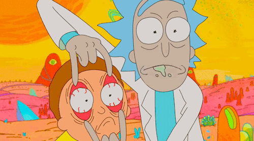
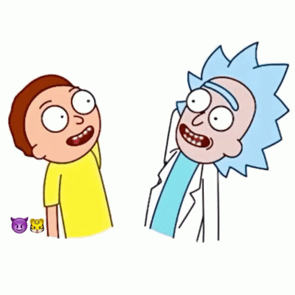

# Rick e Morty em busca do portal

 

É um projeto de um jogo simples criado com a biblioteca javascript p5.js, em uma das aulas iniciais do curso de Desenvolvimento de Software com foco em back-end da Cubos Academy, como uma forma mais descontraída do professor Guido Cerqueira nos mostrar como era programar. 

Escolhi como tema para meu jogo a animação Rick and Morty, que é uma das minhas favoritas. O objetivo é ajudar eles a encontrar o portal correto para se encontrarem com seus amigos. 

Primeiro foram criadas variáveis para carregar as imagens que serão usadas no jogo. Também foram definidas algumas variáveis iniciais, de tamanho, cores, a posição do personagem e do portal.

Para configurar o jogo, inicialmente foi usada a função **setup()**, que é executada apenas uma vez no início do jogo. Nela, foi definido o tamanho do canvas usando a função **createCanvas()**, carregadas as imagens usando a função **loadImage()** e criado o código que faz o portal correto ser sempre um aleatório dentre os vários existentes.

Para o Loop Principal do Jogo foi usada a função **draw()**. Nela, foi desenhado continuamente os elementos do jogo, como o fundo, os portais, os personagens e as caixas de texto inicial e final. Ela é executada continuamente em um loop infinito até que o programa seja encerrado, dentro da função é verificado continuamente se os personagens chegaram ao portal correto e caso isso aconteça, é exibido o texto de vitória, carregada uma nova imagem e criado um botão para reiniciar o jogo. Quando o botão reiniciar é clicado, a função **reset()** é chamada. Nela, as variáveis do jogo são reiniciadas, e então é gerada uma nova posição para o portal correto e o loop do jogo é reiniciado também.

O Movimento do Personagem foi feito com a função **keyPressed()**, que é chamada sempre que uma tecla é pressionada. Dentro dela, verificamos qual tecla foi pressionada usando a função **keyIsDown()** e movemos o personagem na direção correspondente alterando as variáveis equivalentes. 

As tecnologias utilizadas foram, a biblioteca de javascript p5.js,e HTML e CSS que já vinham predefinidos pela própria biblioteca. 

# O site utilizado
 

# imagens do jogo
 

 

 

 Link do jogo
 https://vitorialilian.github.io/rick-e-morty-em-busca-do-portal/

